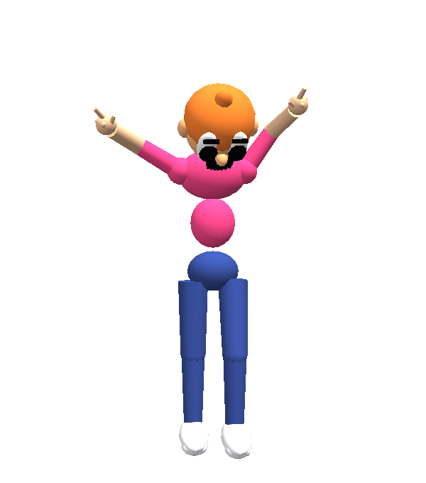

# Cringe Dancer — a free VST3 / AU plugin with an audio-reactive 3D dancer

**Cringe Dancer** is a free audio plugin for **macOS and Windows** that puts a
3D dancing character inside your DAW. He listens to whatever is playing and
dances to it — badly, on purpose. Part audio visualiser, part mascot, entirely
useless in the best way.

Free download. No licence key, no account, no trial, nothing disabled.

By [EDM Ghost Production](https://edm-ghost-production.com).

## Download

Always the newest version:

- **Download for macOS** — [`CringeDancer-mac.dmg`](https://github.com/alexlarichev/cringe-dancer-releases/releases/latest/download/CringeDancer-mac.dmg) · VST3 + AU (Audio Unit) · Universal, Apple Silicon + Intel · signed & notarized
- **Download for Windows** — [`CringeDancer-Win64.exe`](https://github.com/alexlarichev/cringe-dancer-releases/releases/latest/download/CringeDancer-Win64.exe) · VST3 · 64-bit · signed

## What the plugin does

Put him on a channel or on the master bus. He watches the audio go past and
never touches it — your sound passes through unchanged — he just analyses it
and reacts:

| Your track | Him |
|---|---|
| Silence | Bored. Standing there, breathing. |
| Something quiet comes up | An awkward shuffle. Arms hanging. |
| Build-up (riser, snare roll) | Hands in the air, waiting for it. |
| The drop | Arms down, headbang, fist pumps, full club mode. |
| Absolutely peaking | Overdrive. He loses it. |

It is all **beat-synced**: the dancing follows your project's tempo and
playhead while the transport is rolling, and keeps its own clock at your BPM
when it isn't. He hears the kick, the bass, the highs and every transient, and
an automatic gain stage keeps him dancing on quiet mixes and rough demos too.

## Features

- **10 different dancers.** Each one has his own body, outfit, face and his own
  dance. Click him to switch.
- **Pop-out mode.** One button detaches him from the plugin window and he keeps
  dancing on your desktop, on top of your DAW, with no window frame around him
  — a little audio-reactive sticker on your screen. Drag him to move him, the
  person icon changes dancer, the corner grip resizes him, the X (or Esc) puts
  him back. The empty space around him is click-through, so he never steals a
  click. He keeps going even after you close the plugin window.
- **Resizable** interface, from tiny to full screen.
- **No parameters.** Nothing to automate, nothing to set up, nothing that can
  ruin a mix.
- **Your audio is untouched.** He only listens.

## Compatible DAWs and system requirements

|  |  |
|---|---|
| **macOS** | 11 Big Sur or newer · Apple Silicon (M1/M2/M3/M4) and Intel · **VST3 + AU** |
| **Windows** | Windows 10 / 11, 64-bit · **VST3** · signed installer |

Works in any VST3 host — **Ableton Live, FL Studio, Cubase, Studio One, Reaper,
Bitwig Studio, Mixcraft** and the rest. The Audio Unit build covers **Logic Pro
and GarageBand** on macOS. Your graphics driver needs OpenGL 3.2, which
anything from the last decade has.

## How to install

**macOS** — open the DMG and double-click **Install Cringe Dancer.pkg**. It
installs the Audio Unit into `/Library/Audio/Plug-Ins/Components` and the VST3
into `/Library/Audio/Plug-Ins/VST3`; you can untick either format in the
installer.

**Windows** — run the installer. It puts `Cringe Dancer.vst3` into
`C:\Program Files\Common Files\VST3` (or a folder you choose — if you choose a
custom one, add it to your DAW's plugin scan paths).

Then restart your DAW and look under **EDM Ghost Production**.

## FAQ

**Is Cringe Dancer really free?**
Yes. It is a free plugin, given away by EDM Ghost Production. No licence key,
no account, no time limit, no crippled features.

**Does it change my sound?**
No. The audio passes through completely unchanged — the plugin only analyses it
to drive the animation. You can leave it on the master while you work.

**Which formats does it come in?**
VST3 and AU (Audio Unit) on macOS, VST3 on Windows. There is no VST2 or AAX
version.

**Does it work in Logic Pro?**
Yes — install the AU version from the macOS installer and it shows up in
Logic Pro and GarageBand under EDM Ghost Production.

**Can I put the dancer on my desktop or on stream?**
Yes. Pop-out mode gives you a frameless, always-on-top, click-through dancer
that sits over your DAW — easy to capture in OBS.

**Where is the source code?**
This repository hosts the installers only; the source is private.

---

Made by [EDM Ghost Production](https://edm-ghost-production.com) — ghost
production, mixing and mastering for electronic music.
